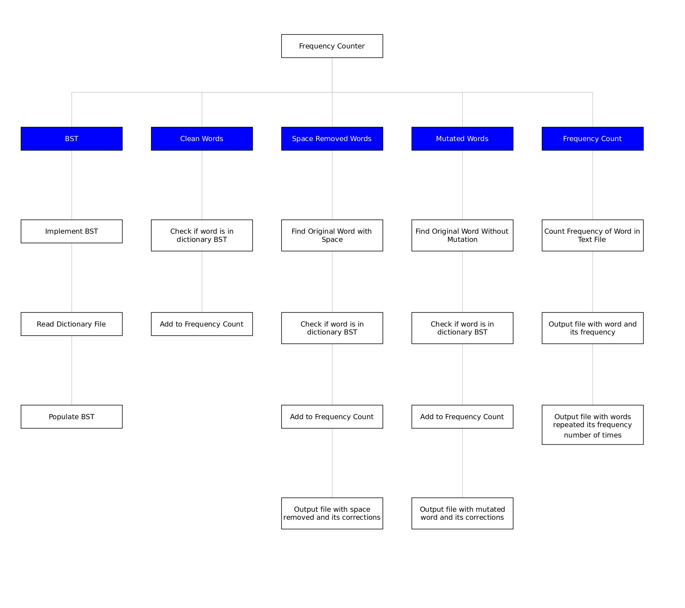
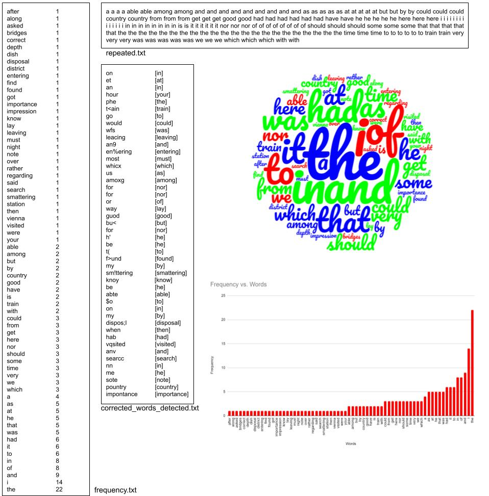

# Word Frequency Counter

COEN 352 (Data Structures and Algoritms) Word Frequency Counter Project - Fall 2019

## Objective
Develop an application that given a dictionary of distinct words and an input text file, it finds the frequency of words in the text file that exist in the dictionary. 

## Description
The dictionary is a text file that consists of a distinct set of words separated by spaces.

The Input Files used for testing are chapters from a book. The text file includes punctuation, new lines and other characters. 

There are 3 types of input files:
1. Clean
    -  One-page text files with around 300 words
2. Space Removed
    -  One-page text files with random spaces removed.
3. Character Mutated
    -  One-page text files with a character in a word substituted with another random character (any character including spaces, newline, tabs, etc.)

## Core Features
1. The dictionary of words is stored in a BST implemented purely by me. 
2. The dictionary text file is read and a BST is created with those words when the program starts. 
3. Search from the dictionary words is done using the BST

Output of the application for clean input files:
- Frequency of words (case insensitive) in the input file that exists in the dictionary
    - sorted by their frequencies and then alphabetically in ascending order.
    - frequencies.txt
- Text file of words repeated by their frequencies sorted alphabetically.
    - repeated.txt
- Text file containing each word with space removed detected as a word in the dictionary
    - Presented in its original form and after adding the space.
    - corrected_words_detected.txt
- Text file containing each word with character removed detected as a word in the dictionary
    - Presented in its original form and corrected form.
    - corrected_words_detected.txt

## Created By
- Jasen Ratnam (Git Username: JasenRatnam)

## Tools and Technologies
- Languages:
  - Java
- Technology:
  - Netbeans
  - WordClouds
  - Excel

## Project
### WBS of project

### Result of Application

